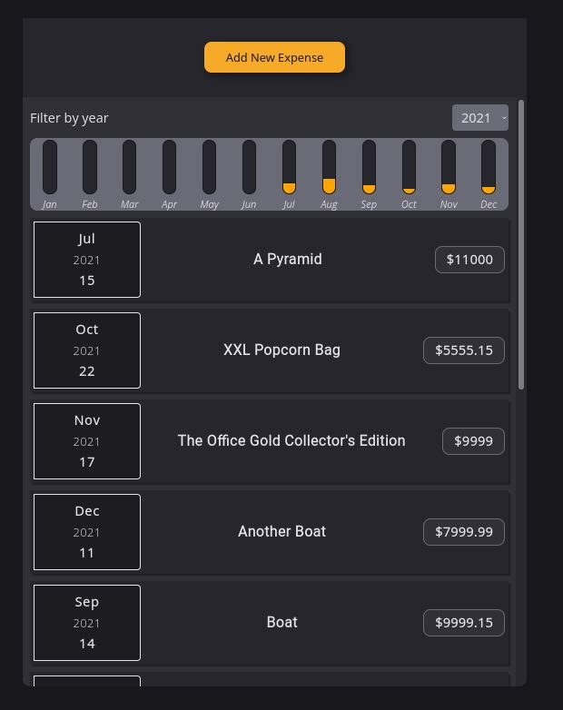

# Expense Tracker



My first **React** project! A simple, fully-responsive, expense tracker that allows expense input and outputs a concise overview of the spending on a monthly basis. It was created as part of practising with React, while pursuing the **React** section of The Odin Project.

## Installation

As this project was bootstrapped with React, the following scripts are available:

**Install** the dependencies:

```
npm install
```

Launch the **test runner** in the interactive watch mode:

```
npm test
```

**Remove** the single build dependency from the project:

```
npm run eject
```

## Features

- Filtering on a yearly basis.
- Live cost-aggregation display.

## Tech

- React
- JavaScript
- SASS

For a more detailed overview of the development & production dependencies, please check `package.json`.

## Live Version

<https://developedbygeo.github.io/Expense-tracker/>

## Contributing

Contributions are certainly welcome. Please feel free to open an issue/PR if there is something you would like to be changed.

## Acknowledgements

A massive thank you to Maximilian Schwarzmüller & The Odin Project for their guidance and quality material.

## License

[MIT](./LICENSE.md)
